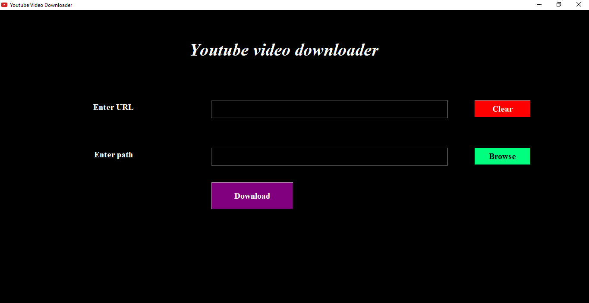
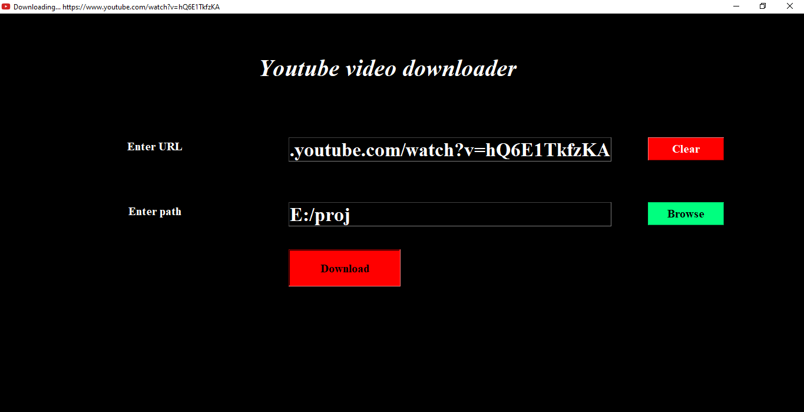
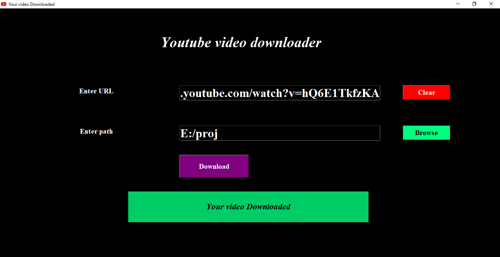

### Youtube Video Downloader 

### Code Requirements
- Youtube_dl library 
- Tkinter(Avaialble in python)

### Installation
- pip install youtube_dl 
- Copy my youtube.py
- Run it

### Description
It is just simple GUI which are made with Tkinter, it can download any of youtube video ,you need to just copy link of video and path where you want to save your file.

### Screenshots

